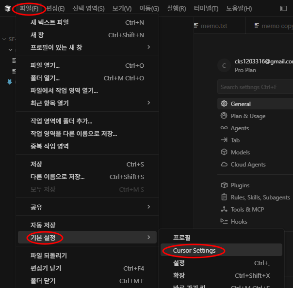
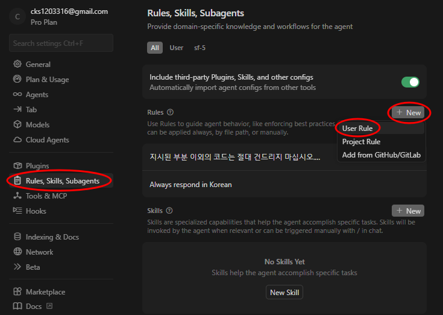
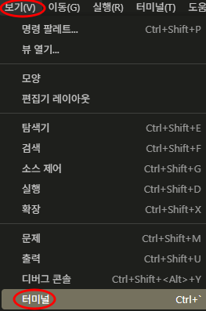
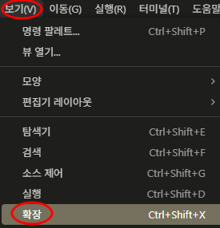
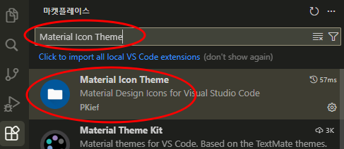

## 1. Cursor AI Rules(User Rule) 설정

### 1-1 Cursor Settings open



<br><br>



<br><br><br><br>


### 1-2 User Rules 기입

```text
- 모든 설명과 주석은 한국어로 작성해 줘
- 간결하게 핵심만 답변하고, 불필요한 서론은 생략해 줘
- 코드를 수정하기 전 잠재적 오류나 영향도를 먼저 분석해 줘
- 모호한 요청 시 임의로 작성하지 말고 먼저 질문해 줘
- 새 파일을 만들 때는 프로젝트의 기존 폴더 구조를 따라줘
- 지시된 부분 이외의 코드는 건드리지 말아줘
- 기존 코드의 로직을 임의로 변경하지 말아줘
- 내가 확인할 내용이나, 동작을 취해야 할 것들은 응답내용의 맨 마지막에 간단히 넣어줘
- Windows + PowerShell 환경을 기본으로 하고 있어
```

---
<br><br><br><br><br><br><br><br>


## 2. Powershell 설정 

### 2-2 Terminal 열기



```powershell
Set-ExecutionPolicy -Scope CurrentUser RemoteSigned
```

```powershell
Get-ExecutionPolicy -List
```

---
<br><br><br><br><br><br><br><br>


## 3. Plugin 설치

### 3-1 설치될 Plugin 들

- Korean
- Material Icon Theme
- GitHub Theme
- Live Server
- indent-rainbow
<br><br><br><br>


### 3-2 Material Icon Theme 설치 예



<br><br>



<br><br><br><br>


### 3-3 나머지 Plugin 도 마켓플레이스에서 찾아 설치

---
<br><br><br><br><br><br><br><br>


## 4. tree indent 조정

- [File] -> [Preferences] -> [settings]
- tree 검색
- Workbench > Tree:Indent -> 20 으로 조정
- 
---


